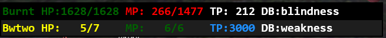

# Party Menu

This customizable addon tracks and displays all party members HP, MP, TP, and
active debuffs. This addon was intended to be a quality of life enhancement for
white mages and other support jobs that need to worry about keeping people
alive and debuff free. It is possible to change how player names, hp, mp, tp,
and debuffs are displayed if you want to display them at all, and highlights
rows based on what party member you are targetting. This is what the addon
looks like in action:

## Party Menu Commands

1. The help command displays all possible commands
    * /pm help
    * /pm h
2. The toggle ui command can hide or show the party_menu overlay
    * /pm t
    * /pm tog
    * /pm toggle
3. The toggle name display command can hide or show party member names in the overlay. Names are shown by default.
    * /pm name
    * /pm names
4. The toggle hp command will rotate between showing a party members missing hp, current hp, current hp and max hp, or hide hp values altogether. Missing hp is shown by default.
    * /pm hp
5. The toggle mp command will rotate between showing a party members current mp,current mp / max mp, or hide mp values altogether. MP is hidden by default.
    * /pm mp
6. The toggle tp command can hide or show the tp values of all party members. TP values are hidden by default.
    * /pm tp
7. The toggle debuffs command can either show or hide the debuff lists of a party. Debuffs are shown by default.
    * /pm db
    * /pm debuff
    * /pm debuffs
8. Names, HP, and MP values are colored accoring to their overall remaining percentages. TP values are colored if they acheive a value of 1000 or greater. Should this default dynamic coloring be distracting you can toggle it off or on with the following command.
    * /pm color
9. To change the text size and overall height of the display you can use the size command. By default the size is 20, and the input new_size must be an integer between 0 and 50 inclusive.
    * /pm size [new_size]
10. To change the position of the overlay you can use the position command. Keep in mind the x and y coordinates provided are the coordinates of the bottom row of your last party member, the overlay will expand upwards from this point as new party members are added, and will get compress to this point as party members leave, the default values if they are not provided are x = 20, y = 100, these coordinates must be integers between the values of 0 and 50000 inclusive.
    * /pm pos [new_x] [new_y]
    * /pm position [new_x] [new_y]
11. To change the overall width of the overlay you can use the following equivalent commands. Note that the input width must be an integer between 0 and 50000 inclusive and has a default value of 500 if it is not provided.
    * /pm wid [new_width]
    * /pm width [new_width]
12. Should you use commands 3 to 11 and find settings you are happy with, you can save your settings with one of the following equivalent commands.
    * /pm s
    * /pm save
